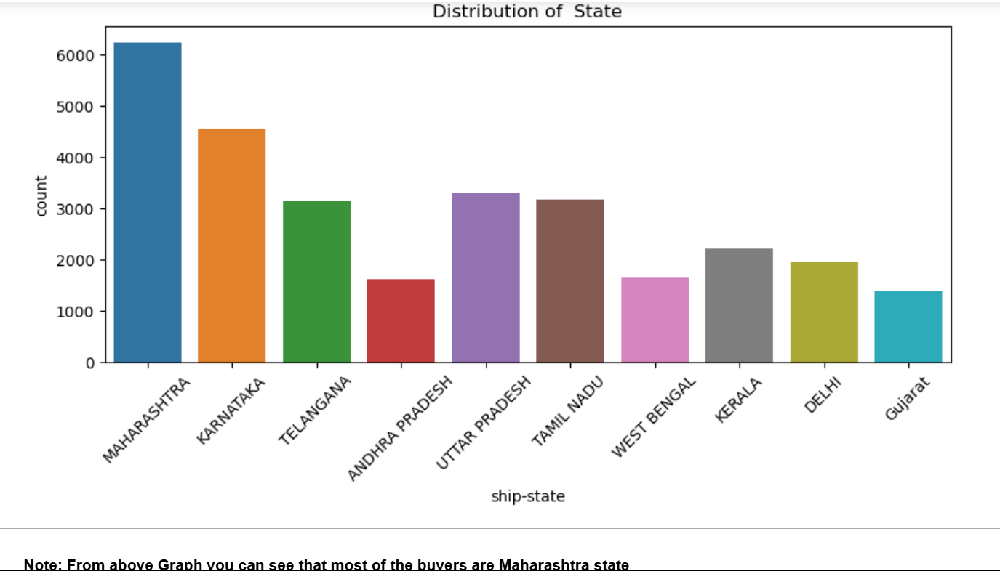
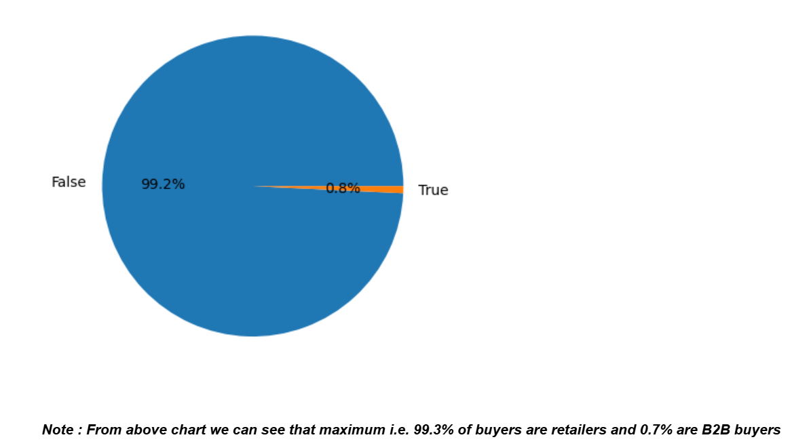

# 📊 Amazon Sales Analysis with Python

## 📌 Objective
Analyze Amazon sales data to uncover insights into customer behavior, product performance, and sales trends. The goal is to support business decision-making and drive improvements in sales, efficiency, and customer satisfaction.

---

## 🛠️ Project Overview
This project utilizes a real-world Amazon sales dataset to deliver actionable business intelligence through:

1. **Data Cleaning & Preprocessing**
    - Handling missing values  
    - Removing duplicates  
    - Standardizing column formats

2. **Exploratory Data Analysis (EDA)**
    - Analyzing sales distribution by category, product, and region  
    - Revenue breakdown across segments  
    - Visualizations of purchase patterns

3. **Insights & Recommendations**
    - Identifying top-performing categories  
    - Highlighting growth opportunities  
    - Suggesting strategies for retention and expansion

---

## 📂 File Structure

Amazon-Sales-Analysis-Python/
│
├── data/
│ └── Amazon Sale Report.csv # Raw sales dataset
├── notebooks/
│ └── Amazon Sale Report.ipynb # Jupyter notebook with analysis
├── images/
│ ├── statedistri.jpg
│ ├── buyers.jpg
│ ├── tshirt-buyers.jpg
│ └── amazonsalestopProd.jpg
└── README.md # Project documentation

---

## 🔍 Key Insights

### Distribution of State

> From the above graph, you can see that most buyers are from Maharashtra state.

---

### Buyer Segment

> From the above chart, 99.3% of buyers are retailers, and only 0.7% are B2B buyers.

---

### Top Products

> T-shirts are the most purchased product among buyers.

---

### Popular Sizes

> M-size is the most frequently bought, making it a key focus for inventory and marketing.

---

## 📈 Conclusion

- The business has a strong base in **Maharashtra**.
- **Retailers** form the primary customer segment.
- **T-shirts (M-size)** are consistently in high demand.
- Optimized **Amazon logistics** ensure efficient order fulfilment.

> **Recommendations:**  
> - Focus marketing & stock efforts in Maharashtra  
> - Strengthen relationships with retailer customers  
> - Maintain high stock levels of T-shirts (especially M-size)  
> - Continue optimizing Amazon-based delivery for reliability

---

## 🚀 Tools & Technologies

- **Python**: Pandas, NumPy, Matplotlib, Seaborn
- **Jupyter Notebook**: Data analysis & visualization
- **CSV Dataset**: Amazon sales data

---

## 👤 Author

- **Kulvant Dhaker**
- [GitHub](https://github.com/DhakerKulvant)
- [LinkedIn](https://www.linkedin.com/in/dhakerkulvant01)

